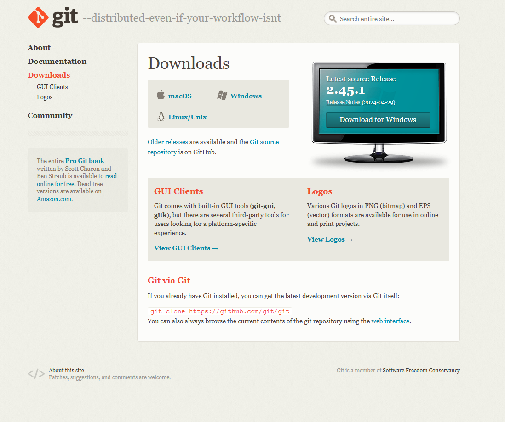

# Installation

### Step 1
You can install git from the website [Git](https://git-scm.com/downloads)
<br>
<br>

<br>
### Step 2
After Downloading , You can run the exe file which you have downloaded to install git in your local machine(your pc).
<br>

### Step 3 
After executing the exe file ,you can choose the settings as per your need (for beginners ,choose recommended settings).
<br>
There will be option for ```Git GUI``` and ```Git Bash```. Choose them.

### Step 4
After installation ,run the git bash and run the command ```git```
